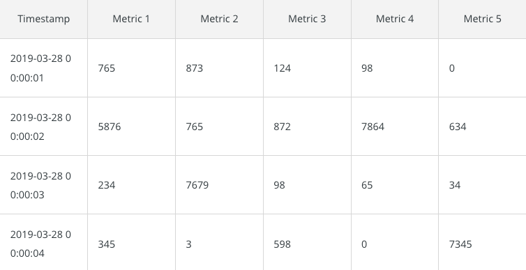

# Time series databases

Time series databases are designed based on the idea that data changes through time. Some visualize this type of data bases as sequence of data points over time, stored in time order. Time is the central piece of times-series databases. For each "timestamp" we have records for the metrics. (Table example)

There are two ways of managing the data, each table for each metric where the metric is the ID of the table or collection of different metrics per time.

An example of the format here:

You may wonder, if there are a lot of databases that manage timestamps, for example SQL. Why use them? Time series databases are highly optimized for managing data using time as an identifier. The idea of the optimizations comes from this assumptions of the use of time series data base:

- The data that arrives is almost always recorded as a new entry.
- The data typically arrives in time order.
- Time is a primary axis.

## Examples 

- InfluxDB
- Prometheus
- Timescale

# In-memory databases

Usually classic database as SQL, store all the information in a hard drive or in solid state drives. As you may know the this type of memory is much slower to access compared to the Random Access Memory (RAM). Therefore in tasks where the database response time is critical, In-Memory databases comes handy. Given that the main characteristic of this kind of database are that they operates on RAM memory; this allows really fast response times. 

Application of this databases can be gaming headboards, where new scores are created in seconds. Then, in order to have the database updated in real time, a databases with fast memory reading comes handy.

## What happens if the machine shuts down?

For know there are some solutions for this problem:

- Snapshots: Each amount of time the database creates a backup of the data in a non volatile memory, this allow to restore the data if something goes wrong with the energy supply:

- NVRAM technology: NVRAM stands for Non-Volatile Random Access Memory. This means that the database is saved on a RAM that does not wipe-out the data if the energy stream cuts.

# Search databases
